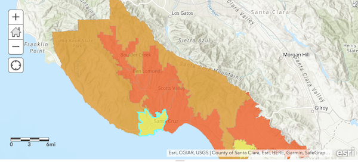

## Koop PostGIS provider
 Koop [provider](https://koopjs.github.io/docs/usage/provider) to query [PostGIS](https://postgis.net/) spatial data, convert it to [GeoJSON](https://geojson.org/) as input into [Koop](https://koopjs.github.io/) and convert into the GeoServices specification supported by ArcGIS products.

## Dependencies
- [Koop](https://koopjs.github.io/)
- [bluebird](http://bluebirdjs.com/docs/getting-started.html)
- [config](https://lorenwest.github.io/node-config/)
- [Lodash](https://lodash.com/)
- [pg-promise](https://vitaly-t.github.io/pg-promise/)

## Database configuration
- Open **config/default.json** and set your database connection parameters

```json
{
  "db": {
    "host": "host",
    "port": 5432,
    "database": "dbname",
    "user": "user",
    "password": "password"
  }
}
```

## Test it out
Run server:
- `npm install`
- `npm start`

**Example API Query:**

Replace `${schema}.${table}` with **schema.table** from your PostGIS db to translate.

```bash
curl localhost:8080/pg/${schema}.${table}/FeatureServer/0/query
```

**Add as Feature Layer**

- Esri Leaflet

```javascript
// esri leaflet feature layer
L.esri.featureLayer({
    url: 'http://localhost:8080/pg/${schema}.${table}/FeatureServer/layers'
  }).addTo(map);
````


- ArcGIS Online WebMap

```bash
https://www.arcgis.com/home/webmap/viewer.html?url=http://localhost:8080/pg/${schema}.${table}/FeatureServer/
```



## Contributors
<a href="https://github.com/doneill/koop-provider-pg/graphs/contributors">
  
</a>

## Licensing
A copy of the license is available in the repository's [LICENSE](LICENSE) file.